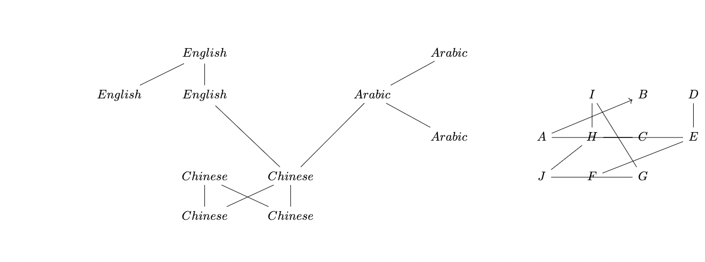

### *on optimizing network modularity*

<figure>

    <figcaption></figcaption>
</figure>

Consider the following problems:

* You have a data on a large collection of politically active Twitter users and their followers . Can you classify people based on how similar their political ideologies are? [^1]

* You are a streaming service with information on users' viewing 
preferences. Can you find categories of people with similar tastes in order to 
fine-tun your recommendations to them?[^2]

* You have a protein-protein interaction network. Can you 
find polypeptide chains which are responsible for 
generating a certain biological process? [^3]

* You have a database of drug-gene interactions. Can you find
pharacological pathways by looking at clusters of genes 
and drugs?[^4]

Note that the task in all of these problems 
is fundamentally the same - we have network of nodes, 
and a collection of edges
between them. We want sort to the network into a 
collection of groups, identified with some characteristic, such that nodes within a group are more likely 
to be connected to each other, 
and less likely 
to be connected to  nodes outside their group. To do so, first, we must find a way of measuring how 
good a particular sorting is, and then, we must find the 
optimal sorting.
Unfortunately, this task, known as 
modularity maximization, is NP-complete[^5].
 This purpose 
of this post is to describe a clever heuristic 
to solve it in $O(n\log(n)$ time!

## Modularity

Take an arbitrary graph whose nodes are each identified by 
some finite set $i=\{1,2,3,...\}$. We say that the graph 
is assortative provided that we expect that nodes of the 
same type are relatively likely to be connected compared 
to nodes of some different type. For example, consider a
graph of people, where a connection represents familiarty 
between two individuals. One potiential assortative 
characteristic would be the language they speak.

<figure>

    <figcaption>These two graphs are identical, but labeling and rerrangement makes its divisons clear</figcaption>
</figure>

Not all English speakers talk to each other 
and some Chinese speakers speak to Arabic speakers, so 
none of the boundaries are absolute - and yet, there are 
clearly natural groups which form. 

[^1]:<a href="https://arxiv.org/pdf/2204.07436.pdf">https://arxiv.org/pdf/2204.07436.pdf</a>
[^2]:<a href="https://ieeexplore.ieee.org/stamp/stamp.jsp?arnumber=7363828">https://ieeexplore.ieee.org/stamp/stamp.jsp?arnumber=7363828</a>
[^3]:<a href="https://www.ncbi.nlm.nih.gov/pmc/articles/PMC8430217/">https://www.ncbi.nlm.nih.gov/pmc/articles/PMC8430217/</a>
[^4]:<a href="https://www.ncbi.nlm.nih.gov/pmc/articles/PMC8099108/#B30">https://www.ncbi.nlm.nih.gov/pmc/articles/PMC8099108/#B30</a>
[^5]:<a href="hhttps://arxiv.org/pdf/physics/0608255.pdf">https://arxiv.org/pdf/physics/0608255.pdf</a>
